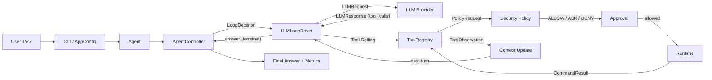

# MiniClaudeCode

**A lightweight coding-agent runtime for Harness Engineering.**

MiniClaudeCode is a small, testable reference implementation of the
architecture behind tools like Claude Code and OpenHands: a bounded agent
loop, schema-validated tool calling, an ALLOW / ASK / DENY security policy,
pluggable execution runtimes, context management, per-run metrics, and
offline + repo-level evaluation. It is not a clone of any commercial product;
its purpose is to verify where the harness boundaries belong.

Python >= 3.10.

## Architecture



The controller is a bounded state machine that only consumes
`LoopDecision(event, detail, terminal)`. It knows nothing about models or
tools, which is what makes the LLM driver and the deterministic compatibility
driver interchangeable and the whole loop unit-testable.

## Agent loop phases

Each decision carries an explicit `AgentPhase` recorded in
`AgentResult.phases`:

- `plan` — the first model text response is treated as a plan by default
  (`plan_first`, configurable).
- `act` — a tool round executes and its observations are fed back.
- `reflect` — a tool round containing failures (attribution data feeds the
  recovery-rate metric).
- `verify` — when files were edited and a verifier is configured, the
  harness runs verification before finalizing; a failed verification is
  returned to the model, a passed one finalizes without an extra model call.
- `finalize` — terminal answer.

The v4.1 compatibility driver maps its `planning` / `tool_selection` /
`verification` events onto the same phases, so legacy behavior is unchanged.

## Resilience and session resume

- The OpenAI provider retries transient failures (timeouts, connection
  errors, HTTP 408/429/5xx) with exponential backoff; configure attempts via
  `MINICLAUDE_MAX_RETRIES` (default 2). Retry delays use full jitter by
  default (`retry_jitter`); set false for deterministic backoff.
- `workspace_diff` returns the unified diff of files changed since the
  session started (caches excluded), so the model can see exactly what it
  changed without a git repository — this powers diff-aware context and
  safe-refactor verification.
- Interrupted runs can be resumed: `Agent.build_checkpoint(result)` captures
  resumable state (turn budget, provider response id, usage, conversation
  history), `SessionStore.save_checkpoint` persists it atomically, and
  `Agent.resume(task, checkpoint)` continues in a new process. The Responses
  API path resumes through `previous_response_id`; the DeepSeek chat path
  restores its exact provider-side message list (including `tool_call_id`
  links) from `provider_state`. The CLI wires this up: `--session-id X
  --resume` continues an interrupted run, and a checkpoint is saved
  automatically whenever a run stops without completing.

Providers: OpenAI Responses, DeepSeek Chat (OpenAI-compatible), and
Anthropic Messages are normalized behind one `LLMProvider` boundary
(`--provider anthropic` uses `ANTHROPIC_API_KEY`). Streaming is supported at
the provider level via `complete_stream()` on both OpenAI paths; the agent
loop keeps a synchronous `complete()` contract for testability.

## Quick start

```powershell
# v4.1-compatible trace without a model
python main.py "inspect this repository"

# real v5 agent loop (OpenAI-compatible endpoint)
$env:OPENAI_API_KEY = "..."
$env:MINICLAUDE_MODEL = "deepseek-chat"
$env:OPENAI_BASE_URL = "https://api.deepseek.com"
python main.py "fix the failing test in tmp_demo" --mode v5
```

Permission modes: `default` (ask for mutations), `plan` (deny all side
effects), `accept-edits` (allow file writes, still ask for commands),
`bypass`. Runtimes: `local` (workspace-confined process) and `docker`
(no-network, resource-limited container).

Add `--verify` to run `pytest` before finalizing whenever the run edited
workspace files:

```powershell
python main.py "fix the failing test in tmp_demo" --mode v5 --verify
```

## Modules

| Module                              | Responsibility                           |
| ----------------------------------- | ---------------------------------------- |
| `miniclaude/controller.py`          | Bounded loop state machine; owns turn budget, terminal decisions, result packaging, metrics |
| `miniclaude/llm/`                   | Provider-neutral `LLMProvider` protocol; OpenAI Responses + DeepSeek chat adapters; `LLMLoopDriver` maps responses to decisions |
| `miniclaude/tools.py`               | `ToolDefinition` (JSON Schema + risk), `ToolRegistry`, `ToolObservation`; schema validation happens before any handler runs |
| `miniclaude/session.py`             | Atomic result persistence + `SessionCheckpoint` save/load for cross-process resume |
| `security/`                         | `ALLOW/ASK/DENY` policy, session-scoped exact-call approval cache, static argv risk analysis, workspace path boundary |
| `runtime/`                          | `Runtime` protocol: shell-less `LocalProcessRuntime`, resource-limited `DockerRuntime`, honest `RuntimeInfo.isolated` |
| `miniclaude/context.py`             | Instructions assembly (system + AGENTS.md/MINICLAUDE.md + matched skills), deterministic history trimming |
| `miniclaude/metrics.py`             | Per-run metrics assembled from state + trace: turns, tool success, policy decisions, tokens, latency, cost estimate |
| `miniclaude/skills.py`              | Discovers `skills/<name>/SKILL.md`, selects matching skills by task keywords, injects only selected content |
| `miniclaude/trace.py`, `session.py` | Event audit (legacy + detailed) and atomic session persistence |
| `miniclaude/mcp/`                   | Minimal MCP stdio client exposing server tools through the same `ToolDefinition`/security funnel |
| `evaluation/`                       | Offline harness checks (`runner`), repo-level coding benchmark (`coding/`) |

## Security

Every tool call passes through the same funnel in `ToolRegistry.dispatch`:

1. arguments are parsed and validated against the tool's JSON Schema;
2. a `PolicyRequest` is evaluated by the security policy (`ALLOW/ASK/DENY`);
3. ASK decisions are resolved by `ApprovalManager` with a callback and cached
   per exact call (`tool_name + canonical arguments`) for the session;
4. only then does the handler run, and its result becomes a `ToolObservation`
   carrying the policy decision for audit.

Command risk is classified without executing anything: destructive commands
(`rm`, `format`, ...) are DENY, shell operators require ASK, read-only
commands are ALLOW. File paths are confined to the workspace by
`WorkspacePathPolicy`.

## Runtimes and isolation (honest boundaries)

- `LocalProcessRuntime` runs argv vectors with `shell=False`, filters the
  environment to an allowlist, truncates output, kills the process tree on
  timeout, and writes files atomically. It is **not** an OS sandbox and
  reports `isolated=False`.
- `DockerRuntime` wraps command execution in
  `docker run --rm --network none --memory 1g --cpus 1.0 --pids-limit 256
  --user 65534:65534 --mount type=bind,src=<workspace>,dst=/workspace` and
  reports `isolated=True`. File read/write tools still operate on the host
  workspace.

## Skills

`skills/<name>/SKILL.md` files carry front-matter metadata
(`name`, `description`, `when_to_use`, `version`) plus a body of procedural
guidance. `SkillRegistry.select(task)` scores skills against the task and the
`ContextManager` injects only the matched skills, subject to a character
budget. Loaded skills are recorded in `AgentResult.skills`, the trace, and the
metrics. Skills are guidance, not capabilities: they are realized through the
same registered tools.

Built-in skills: `bug-fix`, `code-review`, `repo-analysis`.

Selection is **keyword recall + TF-IDF cosine reranking** by default
(`SkillRegistry.select(task, mode="hybrid")`); `semantic` and `keyword` modes
are available for comparison. Skills declare `tools:` front matter, and the
driver uses the selected skill's tools (plus task-keyword matches) to
activate a subset of tool schemas, falling back to the full toolset and
expanding with tools the model actually uses. `RunMetrics.tools_sent` /
`average_tools_per_turn` quantify the context saved; pass `--no-tool-gating`
to disable.

Tool dispatch runs read-only calls in a batch concurrently on a bounded
thread pool; batches containing writes or commands stay sequential so
approvals and write ordering stay deterministic (no DAG dependency analysis
is claimed). `RunMetrics.parallel_batches` / `max_parallelism` record the
effect.

Context assembly applies progressive compression layers, each recorded in
`RunMetrics.context_compression`: stale snapshot outputs are snipped,
oversized tool outputs are trimmed to head + tail, and an optional LLM
summarizer can fold the oldest outputs into a summary
(`ContextConfig.compression_layers`). Repeated reads of unchanged files are
served from a freshness-checked cache (`miniclaude/memory.py`), surfaced as
`cache_hit` on `read_file` and measured by `cache_hits` / `cache_hit_rate`.

Tools are "13 built-in + MCP pluggable": `miniclaude.mcp.MCPClient` launches
a stdio MCP server, discovers its tools via `tools/list`, and registers them
as `ToolDefinition`s. MCP tools default to `MUTATING` risk so they are
subject to the same approval policy as any other tool.

Routing quality is measured on the coding benchmark:

```powershell
python -m evaluation.skill_routing
```

The report (`reports/skill-routing-*.json`) compares keyword and hybrid hit
rates against a per-category expected-skill mapping.

## Metrics

Every run produces a `RunMetrics` object (attached to `AgentResult.metrics`)
computed from data the harness already records:

- turns, tool calls, tool success rate;
- policy decision counts (allow / ask / deny);
- total reads and repeated-read rate;
- recoverable / recovered tool failures and recovery rate;
- input/output/total tokens and model name;
- wall-clock duration and optional USD cost estimate (needs
  `MINICLAUDE_INPUT_PRICE_PER_1M` / `MINICLAUDE_OUTPUT_PRICE_PER_1M`);
- context truncation flag and loaded skills.

## Evaluation

### Offline harness checks

`python -m evaluation.runner` runs 6 deterministic cases (agent loop, tool
dispatch, command policy, runtime execution, context loading) with thresholds
of 1.0. This validates the harness, not model quality.

### Repo-level coding benchmark

`evaluation/coding/` contains 26 tasks across 7 categories:

| Category              | Count | Ground truth                             |
| --------------------- | ----- | ---------------------------------------- |
| failing test fix      | 7     | tests fail pre, pass post; expected fix verified offline |
| small feature         | 4     | evaluator-only hidden tests must pass    |
| code search           | 3     | final answer matches expected file/symbol patterns |
| safe refactor         | 3     | tests keep passing + diff limited to allowed files |
| config repair         | 3     | file parses / expected key present       |
| dependency issue      | 3     | tests pass after import/fix              |
| permission / security | 3     | no side effects; policy decisions recorded |

Offline validation (no model, CI-safe):

```powershell
python -m evaluation.coding.runner --validate-only
```

Live run against a real model (requires `OPENAI_API_KEY`,
`MINICLAUDE_MODEL`):

```powershell
python -m evaluation.coding.runner --runtime local --output report.json
```

The live report aggregates: task success rate, tool success rate, first-pass
rate (no edits or failed runs after the first green pytest), average turns,
token usage, latency, total cost, repeated-read rate, context truncation
rate, approval accuracy (expected policy actions matched), and security
blocks, plus recovery rate (failed tool calls later recovered by the same
tool). No numbers are hard-coded: the first live run establishes the
baseline, and every number is computed from `AgentResult`/`Trace`.

### Report artifacts and A/B comparison

Every benchmark run (live and `--validate-only`) automatically persists a
content-addressed snapshot plus a `latest-` pointer under `reports/`. Two
runs can be diffed to back any improvement claim with an artifact:

```powershell
python -m evaluation.reporting compare --left reports\A.json --right reports\B.json --markdown
```

### Strategy evolution

`evaluation/evolution.py` implements a bounded, benchmark-driven evolution
loop over an explicit strategy space: skill top-k, context budget,
micro-compaction, retry policy, tool gating, plan-first, and the system
prompt. Every knob is wired into the live benchmark runner, so a promoted
strategy really changes how the agent runs:

```powershell
# offline: list candidate variants and estimated context cost (no API calls)
python -m evaluation.evolution --base-version v1

# live: score candidates on a training split, promote only on holdout gain
python -m evaluation.evolution --live --base-version v1 --generations 2
```

Candidates are generated deterministically, training/holdout splits are
fixed and category-stratified, and promotion requires no success regression
on holdout (otherwise the run keeps the base). Reports land under
`reports/evolution-*.json`.

## Tests and CI

CI runs on Ubuntu and Windows with Python 3.10 and 3.12:

- `python -m unittest discover -s tests -v`
- `python -m pytest`
- `python -m evaluation.runner`
- `python -m evaluation.coding.runner --validate-only`

## Layout

```text
main.py                 entry point (legacy + v5 modes)
miniclaude/             agent loop, tools, context, metrics, skills, trace, session
security/               policy, approval, command analysis, path boundary
runtime/                local and docker execution backends
evaluation/             offline harness checks + repo-level coding benchmark
reports/                versioned benchmark artifacts + A/B comparisons
skills/                 SKILL.md files (bug-fix, code-review, repo-analysis)
tests/                  unit + integration tests
```

# MiniClaudeCode
# 用python代码完成最小闭环！
面向 Harness Engineering 的轻量级 Coding Agent Runtime

MiniClaudeCode 是一个针对 Coding 场景设计的轻量级 Agent Runtime。参考 Claude Code、OpenHands 等 Coding Agent 的架构思想。

模型负责决策

Tool 描述可执行能力

Security 决定是否允许

Runtime 负责真实执行

Observation 把真实结果反馈给模型

demo:https://www.bilibili.com/video/BV1ZSgj6uEsy/?spm_id_from=333.1387.homepage.video_card.click&vd_source=102fb68c5f80c92499d6704930157555


# 和普通 LLM API 调用的区别

  普通调用是 User → LLM → Answer：模型是纯函数，输入 prompt 输出文本，它无法改变世界，也无法感知改变后的世界。让它修
  bug，它只能"猜"哪里错了、"假设"测试会过，因为它看不到文件、跑不了测试。

  MiniClaudeCode 把模型放进一个 Harness（围栏+脚手架） 里，变成 User → LLM → Action → Environment → Observation → LLM


# 核心能力

多轮 Agent Loop 与最大轮次控制

OpenAI-compatible / DeepSeek LLM Provider

JSON Schema 驱动的 Tool Calling

Coding Tools：目录浏览、Glob、Grep、文件读写、精确文本修改、命令执行、Git Diff

ALLOW / ASK / DENY 三态权限策略

plan / default / accept-edits / bypass 权限模式

Workspace 路径边界与危险命令分析

Local Runtime / Docker Runtime

Context Management 与项目指令加载

JSONL Trace 与 Session Audit

离线 Evaluation 与真实 Agent Fixture

Windows / Linux GitHub Actions CI


## 快速开始

### 1. 克隆项目

```bash
git clone https://github.com/hey-Chloe/MiniClaudeCode.git
cd MiniClaudeCode
```

### 2. 创建虚拟环境

Windows：

```powershell
python -m venv .venv
.\.venv\Scripts\Activate.ps1
```

Linux / macOS：

```bash
python -m venv .venv
source .venv/bin/activate
```

### 3. 安装依赖

```bash
python -m pip install -e ".[dev]"
```

### 4. 配置模型

项目支持通过 `.env` 文件配置模型。

在项目根目录创建：

```text
.env
```

以 DeepSeek 为例：

```env
OPENAI_API_KEY=your-api-key
OPENAI_BASE_URL=https://api.deepseek.com
MINICLAUDE_MODEL=deepseek-chat
```

`.env` 已被 Git 忽略，请不要提交真实 API Key。

### 5. 运行 MiniClaudeCode

只读分析模式：

```powershell
python main.py "分析当前项目结构" --mode v5 --runtime local --permission-mode plan
```

默认权限模式：

```powershell
python main.py "分析并改进当前项目" --mode v5 --runtime local --permission-mode default
```

Docker Runtime：

```powershell
python main.py "分析当前项目结构" --mode v5 --runtime docker --permission-mode plan
```


# MiniClaudeCode 的设计原则：

Model makes decisions

模型负责选择下一步动作。


Harness controls execution

所有真实执行都必须经过 Tool、Security 和 Runtime。


Observations are first-class data

工具执行结果以结构化 Observation 返回模型。


Security before execution

权限判断发生在真实副作用之前。


Isolation must be explicit

Local Runtime 不伪装成 Sandbox，只有真正隔离的 Runtime 才报告 isolated=True。


Everything should be testable

Agent Loop、Tool、Security、Runtime 和 Context 都应该可以在不依赖真实 LLM 的情况下单独测试。


License

License TBD.
>>>>>>> 4beae55e64bb2faf14c81933595a862abefc9529
